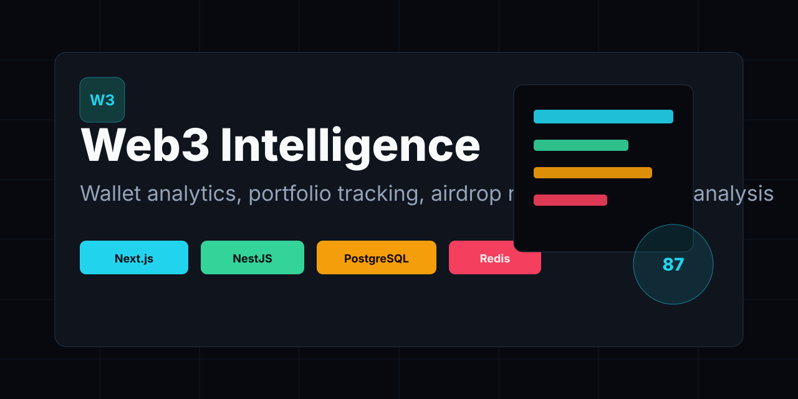

🚀 Web3 Intelligence Platform
Wallet Analytics • Portfolio • AI • Airdrops



A production-minded Web3 intelligence monorepo for wallet analytics, portfolio visibility, airdrop research, multi-chain wallet tracking, and risk analysis.

The project combines a Next.js frontend, a NestJS API, shared TypeScript packages, Prisma persistence, Redis caching, and Viem-based blockchain services. It is designed as a professional open-source foundation for builders who want to ship wallet intelligence products without starting from a blank repository.

- **Project status:** Under Active Development
- **Current version:** `v0.1.0`
- **Demo:** Demo Coming Soon

> Airdrop eligibility estimates are based on public on-chain activity and do not guarantee qualification. Final criteria are controlled by each protocol.

## Features

Implemented:

- Wallet search and address validation for EVM and Solana-style addresses
- Wallet overview API with portfolio value, wallet age, labels, risk score, reputation score, gas spend, token count, and NFT count
- Portfolio API for token balances and chain breakdown
- Airdrop eligibility scoring API with factors, suggestions, and potential campaigns
- Wallet-based auth endpoints for nonce and signature verification flow
- Swagger API documentation
- Prisma PostgreSQL schema for users, wallets, tokens, transactions, risk analyses, airdrop analyses, cache entries, and job logs
- Redis caching with feature-specific TTLs
- Docker Compose for PostgreSQL, Redis, frontend, and backend
- Professional Next.js dashboard surfaces and concept previews for planned modules

Planned or concept preview:

- NFT metadata indexing
- Full transaction history API
- Risk analysis engine
- Token approval scanner
- AI wallet insights
- Portfolio history persistence
- Notifications and alert delivery
- Team workspaces, API keys, webhooks, and enterprise workflows

## Product Surface

- Landing page with wallet search, supported chains, roadmap, and FAQ
- Dashboard home
- Wallet search
- Wallet details
- Portfolio analytics
- Token holdings
- NFTs
- Transactions
- Airdrop eligibility
- Risk analysis
- AI insights
- Profile
- Notifications
- Settings
- 404 and error states

## Architecture

```text
web3-intelligence/
├── apps/
│   ├── frontend/          # Next.js 15 App Router
│   └── backend/           # NestJS REST API
├── packages/
│   ├── shared/            # Shared types, constants, validators, utilities
│   └── blockchain/        # Viem clients and wallet/airdrop services
├── docker/                # Dockerfiles and Docker Compose
├── docs/                  # Product, API, architecture, deployment, security docs
├── scripts/               # Setup and automation scripts
└── .github/               # CI, templates, ownership, and repository automation
```

Clean Architecture boundaries:

```text
Presentation -> Application -> Domain -> Infrastructure
```

Frontend pages and components stay focused on user workflows. Backend controllers expose REST endpoints, services own application logic, repositories handle persistence, and shared packages hold cross-app contracts.

## Tech Stack

| Layer          | Technology                                                                                                        |
| -------------- | ----------------------------------------------------------------------------------------------------------------- |
| Frontend       | Next.js 15, React 19, TypeScript, TailwindCSS, shadcn-style UI, React Query, Zustand, Wagmi, RainbowKit, Recharts |
| Backend        | NestJS, Prisma, PostgreSQL, Redis, BullMQ-ready structure, JWT, Swagger, Helmet, Throttler                        |
| Blockchain     | Viem, Ethers.js-compatible ecosystem, multi-chain constants                                                       |
| Infrastructure | Docker, GitHub Actions, Turborepo, Vercel-ready frontend, Railway-ready API                                       |

## Installation

Prerequisites:

- Node.js `20+`
- pnpm `9+`
- Docker and Docker Compose
- Git

```bash
git clone https://github.com/AanaaAb1/Airdrop-Eligibility.git
cd Airdrop-Eligibility
corepack enable
pnpm install
cp .env.example .env
```

Start local infrastructure:

```bash
pnpm docker:up
pnpm db:generate
pnpm db:push
pnpm db:seed
```

Run development servers:

```bash
pnpm dev
```

Local URLs:

| Service  | URL                                   |
| -------- | ------------------------------------- |
| Frontend | `http://localhost:3000`               |
| API      | `http://localhost:4000/api/v1`        |
| Swagger  | `http://localhost:4000/docs`          |
| Health   | `http://localhost:4000/api/v1/health` |

## Scripts

```bash
pnpm dev          # Start all apps through Turborepo
pnpm build        # Build all apps and packages
pnpm lint         # Run lint checks
pnpm test         # Run test suites
pnpm test:cov     # Run tests with coverage
pnpm format       # Format source, config, and docs
pnpm db:generate  # Generate Prisma client
pnpm db:push      # Push Prisma schema
pnpm db:seed      # Seed demo data
pnpm docker:up    # Start local Docker services
pnpm docker:down  # Stop local Docker services
```

## Environment Variables

Copy `.env.example` to `.env` and configure:

| Variable                               | Purpose                                   |
| -------------------------------------- | ----------------------------------------- |
| `DATABASE_URL`                         | PostgreSQL connection string              |
| `REDIS_URL`                            | Redis connection string                   |
| `JWT_SECRET`                           | JWT signing secret, minimum 32 characters |
| `JWT_EXPIRES_IN`                       | Token expiry window                       |
| `APP_URL`                              | Frontend origin for CORS                  |
| `NEXT_PUBLIC_API_URL`                  | Browser API base URL                      |
| `NEXT_PUBLIC_WALLETCONNECT_PROJECT_ID` | WalletConnect Cloud project ID            |
| `ETHEREUM_RPC_URL`                     | Ethereum RPC endpoint                     |
| `BASE_RPC_URL`                         | Base RPC endpoint                         |
| `ARBITRUM_RPC_URL`                     | Arbitrum RPC endpoint                     |
| `OPTIMISM_RPC_URL`                     | Optimism RPC endpoint                     |
| `POLYGON_RPC_URL`                      | Polygon RPC endpoint                      |
| `BNB_RPC_URL`                          | BNB Chain RPC endpoint                    |
| `AVALANCHE_RPC_URL`                    | Avalanche RPC endpoint                    |
| `SOLANA_RPC_URL`                       | Solana RPC endpoint                       |
| `RATE_LIMIT_TTL`                       | Rate limit window in seconds              |
| `RATE_LIMIT_MAX`                       | Max requests per rate limit window        |

## API Endpoints

Base URL: `http://localhost:4000/api/v1`

| Method | Endpoint                           | Status      | Description                            |
| ------ | ---------------------------------- | ----------- | -------------------------------------- |
| `GET`  | `/health`                          | Implemented | API and service health                 |
| `GET`  | `/wallets/search?address=...`      | Implemented | Validate and analyze a wallet          |
| `GET`  | `/wallets/overview?address=...`    | Implemented | Wallet dashboard overview              |
| `GET`  | `/wallets/recent`                  | Implemented | Recent searches                        |
| `GET`  | `/portfolio?address=...`           | Implemented | Token balances and portfolio summary   |
| `GET`  | `/airdrop/eligibility?address=...` | Implemented | Airdrop eligibility estimate           |
| `GET`  | `/auth/nonce/:address`             | Implemented | Generate auth nonce                    |
| `POST` | `/auth/verify`                     | Implemented | Verify wallet signature and return JWT |
| `GET`  | `/risk/*`                          | Planned     | Risk analysis engine                   |
| `GET`  | `/transactions/*`                  | Planned     | Transaction history                    |
| `GET`  | `/nfts/*`                          | Planned     | NFT metadata and ownership             |

Full reference: [docs/API.md](docs/API.md)

## Documentation

- [Installation](docs/INSTALL.md)
- [API Reference](docs/API.md)
- [Architecture](docs/ARCHITECTURE.md)
- [Database](docs/DATABASE.md)
- [Security](docs/SECURITY.md)
- [Deployment](docs/DEPLOYMENT.md)
- [Contributing](docs/CONTRIBUTING.md)
- [Roadmap](docs/ROADMAP.md)
- [Changelog](docs/CHANGELOG.md)
- [FAQ](docs/FAQ.md)
- [GitHub Repository Metadata](docs/GITHUB.md)

## Screenshots and Mockups

Concept preview assets live in [docs/images](docs/images). They are intentionally labeled as concept previews when a surface is not fully backed by production APIs.

Recommended repository social preview: [docs/images/social-preview.svg](docs/images/social-preview.svg)

## Deployment

Recommended deployment path:

- Frontend: Vercel
- Backend API: Railway
- PostgreSQL: Neon
- Redis: Upstash
- CI/CD: GitHub Actions

See [docs/DEPLOYMENT.md](docs/DEPLOYMENT.md) for production configuration.

## Roadmap

Current milestone: `v0.1.0` foundation.

Near-term priorities:

- Harden wallet and portfolio API integrations
- Add transaction and NFT modules
- Implement production risk analysis
- Add AI wallet insights
- Add E2E tests and performance budgets
- Improve background jobs for indexing and refresh workflows

Full roadmap: [docs/ROADMAP.md](docs/ROADMAP.md)

## Security

- No private keys are requested, handled, or stored
- Wallet connection is delegated to RainbowKit and Wagmi
- API inputs are validated through DTOs and shared validators
- Prisma parameterized queries protect database access
- Redis caches public on-chain data with TTL expiration
- Helmet, CORS, rate limiting, and global validation are enabled in the NestJS API

Report vulnerabilities privately. See [SECURITY.md](SECURITY.md).

## FAQ

**Is the platform production-ready?**

It is a production-oriented foundation under active development. Some modules are implemented, while risk, NFT, transaction, notification, and AI workflows are concept or planned.

**Does a high airdrop score guarantee qualification?**

No. It is an estimate based on public activity and common historical criteria.

**Can this track multiple chains?**

Yes. Shared chain metadata currently covers Ethereum, Base, Arbitrum, Optimism, Polygon, BNB Chain, Avalanche, and Solana.

**Can I deploy it today?**

Yes, with proper environment variables and RPC providers. Review the deployment guide and production checklist first.

## Contributing

Contributions are welcome. Please read [docs/CONTRIBUTING.md](docs/CONTRIBUTING.md), open an issue for substantial changes, and keep feature claims honest when a module is still planned or concept-only.

## Contributors

Maintained by the Web3 Intelligence Platform contributors.

## License

MIT. See [LICENSE](LICENSE).
