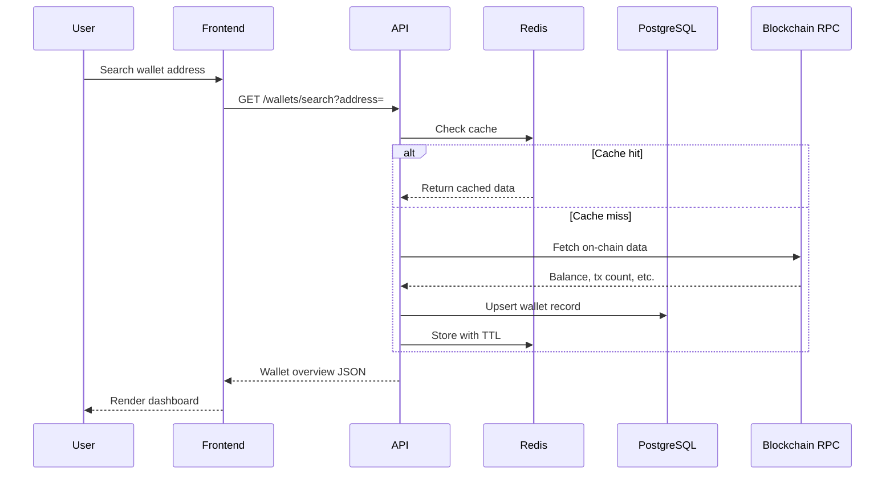

# Architecture

## Overview

The Web3 Intelligence Platform follows **Clean Architecture** with clear separation of concerns across four layers.

```
┌─────────────────────────────────────────────────────────┐
│                    PRESENTATION                          │
│  Next.js Pages · React Components · API Controllers     │
├─────────────────────────────────────────────────────────┤
│                    APPLICATION                           │
│  Services · Use Cases · DTOs · Validation               │
├─────────────────────────────────────────────────────────┤
│                      DOMAIN                              │
│  Entities · Types · Business Rules · Validators          │
├─────────────────────────────────────────────────────────┤
│                   INFRASTRUCTURE                         │
│  Prisma · Redis · Viem · External APIs · BullMQ         │
└─────────────────────────────────────────────────────────┘
```

## Monorepo Structure

```
web3-intelligence/
├── apps/
│   ├── frontend/                 # Next.js App Router
│   │   ├── src/
│   │   │   ├── app/              # Pages (App Router)
│   │   │   ├── components/       # UI components
│   │   │   ├── lib/              # API client, utilities
│   │   │   └── store/            # Zustand state
│   │   └── ...
│   └── backend/                  # NestJS API
│       ├── src/
│       │   ├── modules/          # Feature modules
│       │   │   ├── wallet/
│       │   │   ├── portfolio/
│       │   │   ├── airdrop/
│       │   │   └── auth/
│       │   └── infrastructure/   # DB, cache, external
│       └── prisma/               # Database schema
├── packages/
│   ├── shared/                   # Shared types & utils
│   └── blockchain/               # On-chain services
├── docker/                       # Containerization
├── docs/                         # Documentation
└── scripts/                      # Automation
```

## Data Flow



## Backend Module Pattern

Each feature module follows this structure:

```
modules/wallet/
├── wallet.module.ts       # NestJS module definition
├── wallet.controller.ts   # REST endpoints (Presentation)
├── wallet.service.ts      # Business logic (Application)
├── wallet.repository.ts   # Data access (Infrastructure)
└── dto/
    └── wallet.dto.ts      # Request/response DTOs
```

## Caching Strategy

| Data Type        | TTL    | Invalidation       |
| ---------------- | ------ | ------------------ |
| Wallet Overview  | 5 min  | On refresh request |
| Portfolio        | 2 min  | On new transaction |
| Airdrop Analysis | 10 min | Manual refresh     |
| Risk Analysis    | 5 min  | Manual refresh     |

## Security Layers

1. **Helmet** — HTTP security headers
2. **CORS** — Origin restriction
3. **Rate Limiting** — ThrottlerGuard (100 req/min)
4. **Validation** — class-validator + Zod
5. **JWT** — Wallet-based authentication
6. **Input Sanitization** — Whitelist validation pipe

## Deployment Architecture

```
┌──────────┐     ┌──────────┐     ┌──────────────┐
│  Vercel  │────▶│ Railway  │────▶│ Neon Postgres│
│ Frontend │     │ Backend  │     └──────────────┘
└──────────┘     │          │────▶┌──────────────┐
                 │          │     │ Upstash Redis│
                 └──────────┘     └──────────────┘
```

## Design Decisions

1. **Monorepo with pnpm workspaces** — Shared types between frontend/backend without publishing
2. **Viem over Ethers v6** — Better TypeScript support, tree-shaking, multi-chain
3. **Prisma over TypeORM** — Type-safe queries, excellent migration tooling
4. **Redis caching** — Reduce RPC calls, improve response times
5. **Feature-based folders** — Scales better than layer-based for growing teams
6. **Zustand over Redux** — Simpler API, less boilerplate for client state
