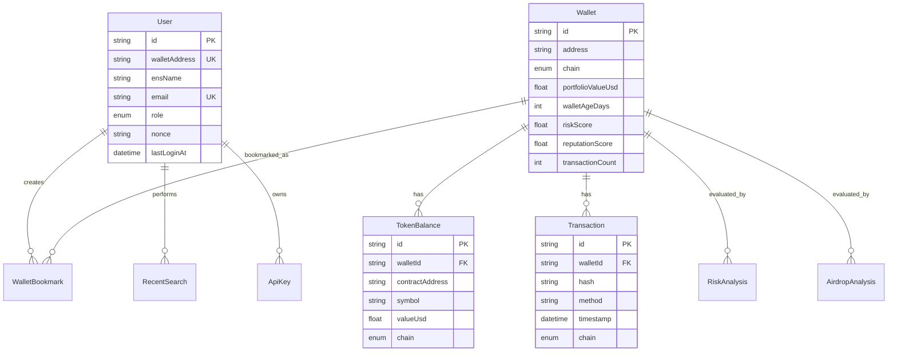

# Database

The backend uses Prisma with PostgreSQL. The schema is designed around wallet intelligence workflows while keeping planned analysis modules separated from implemented API behavior.

## Core Models

| Model             | Purpose                                                  |
| ----------------- | -------------------------------------------------------- |
| `User`            | Wallet-authenticated user profile and role               |
| `ApiKey`          | Planned API key access for programmatic use              |
| `Wallet`          | Chain-scoped wallet analytics snapshot                   |
| `WalletBookmark`  | User-saved wallet records                                |
| `RecentSearch`    | Search history for product workflows                     |
| `TokenBalance`    | Token balances associated with a wallet                  |
| `Transaction`     | Transaction ledger model for the planned transaction API |
| `RiskAnalysis`    | Risk scoring output for the planned risk engine          |
| `AirdropAnalysis` | Airdrop scoring history                                  |
| `CacheEntry`      | Optional database-backed cache records                   |
| `JobLog`          | Background job status and audit log                      |

## Entity Relationship Diagram



## Indexing Strategy

- `Wallet.address` for direct lookup.
- `Wallet.address + Wallet.chain` unique constraint for multi-chain snapshots.
- `Wallet.portfolioValueUsd` for leaderboard or whale workflows.
- `RecentSearch.userId + RecentSearch.searchedAt` for activity lists.
- `TokenBalance.walletId` for portfolio reads.
- `Transaction.walletId + Transaction.timestamp` for paginated history.
- `RiskAnalysis.walletId + RiskAnalysis.analyzedAt` for historical analysis.
- `CacheEntry.expiresAt` for cleanup jobs.

## Local Commands

```bash
pnpm db:generate
pnpm db:push
pnpm db:seed
```

Use migrations before production hardening:

```bash
pnpm --filter @web3-intelligence/backend exec prisma migrate dev
pnpm --filter @web3-intelligence/backend exec prisma migrate deploy
```

## Production Notes

- Use SSL-enabled PostgreSQL connections.
- Store secrets only in environment variables.
- Avoid raw SQL unless it is audited and parameterized.
- Run backups before schema changes.
- Use connection pooling for serverless and hosted environments.
