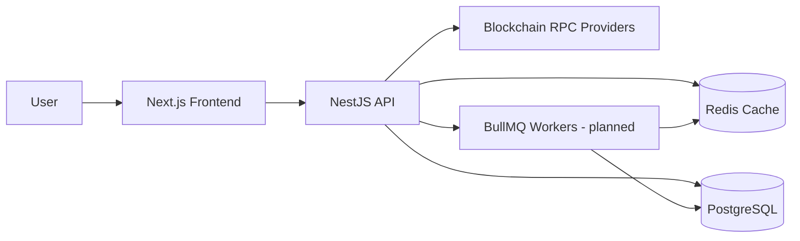
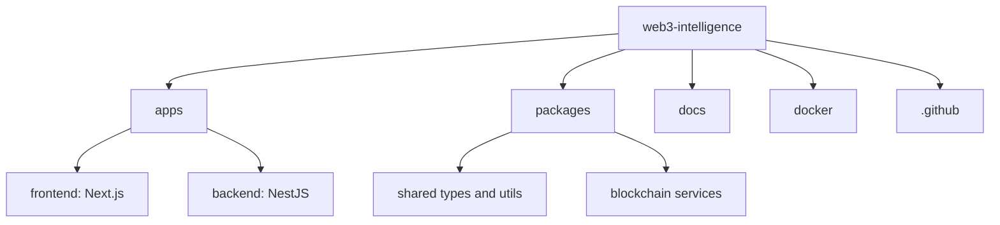
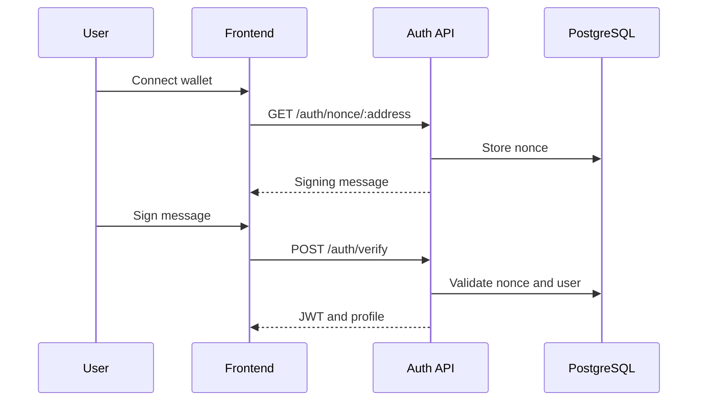
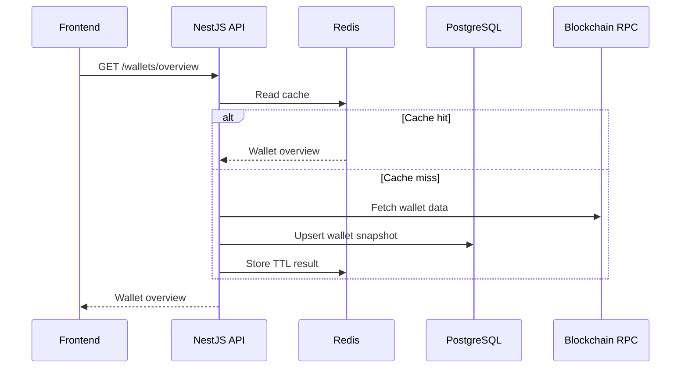
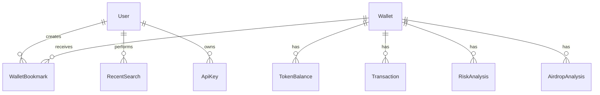
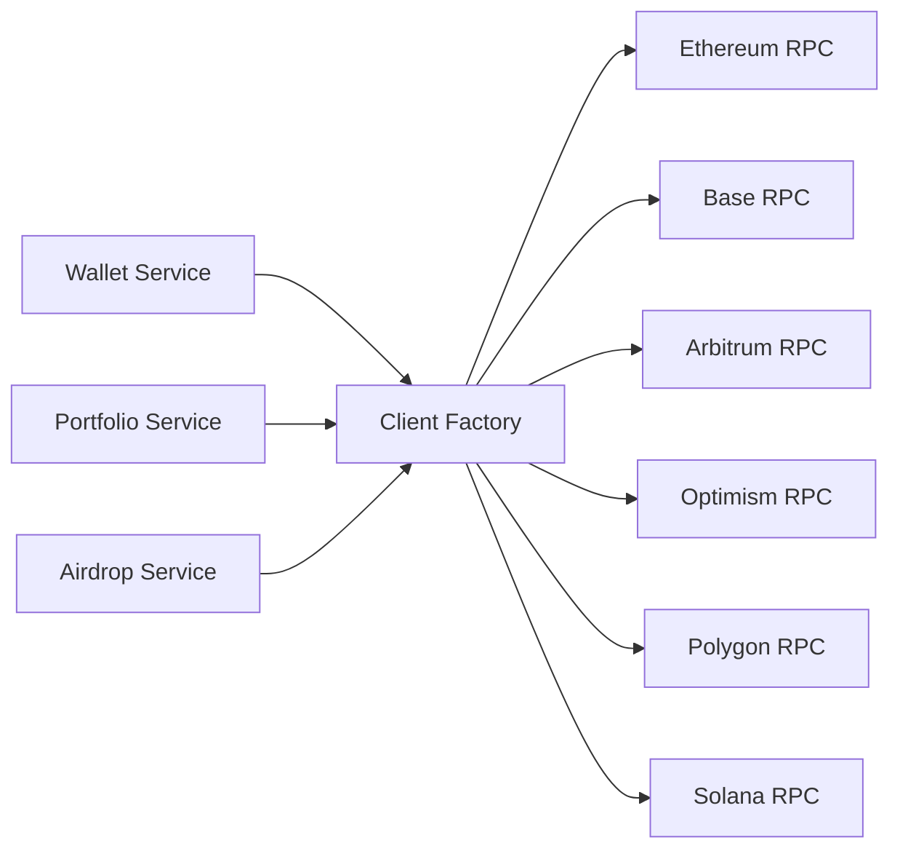
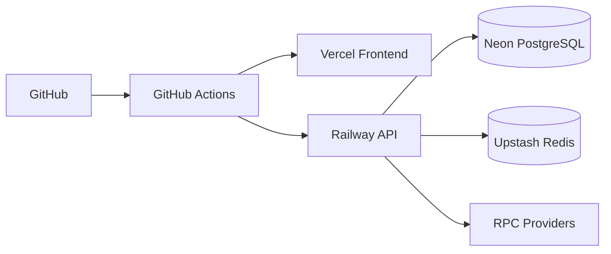
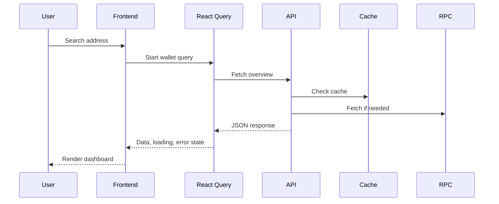
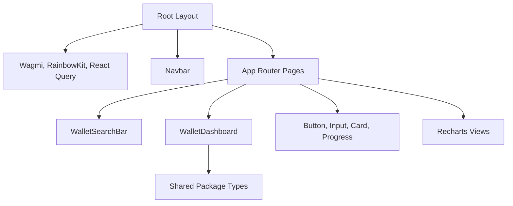

# Architecture Diagrams

## System Architecture

## Folder Structure

## Authentication Flow

## API Flow

## Database ERD

## Blockchain Interaction

## Deployment

## Sequence Diagram

## Component Diagram

